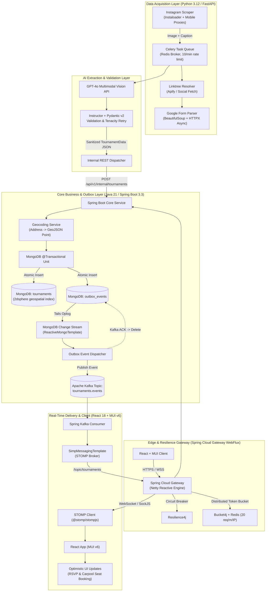

# 🏸 Badminton Tournament Finder

[](https://opensource.org/licenses/Apache-2.0)
[](https://python.org)
[](https://openjdk.org)
[](https://spring.io/projects/spring-boot)
[](https://react.dev)
[](https://mui.com)
[](https://kafka.apache.org)
[](https://mongodb.com)
[](https://redis.io)

An autonomous, event-driven, open-source microservices platform engineered to eliminate information asymmetry in collegiate club sports. The platform autonomously aggregates, extracts, validates, geocodes, and broadcasts real-time badminton tournament intelligence across the collegiate circuit.

---

## 📖 Background & Problem Statement

Collegiate club badminton tournaments across the DMV (DC, Maryland, Virginia) and greater US circuit suffer from severe **fragmentation and data ephemerality**:
- **Social Media Funnel**: Announcements are buried in ephemeral Instagram flyers (`@vcubadmintonclub`, `@umdclubbadminton`, `@towsonubc`, `@umbc.badminton`, `@jhuttc`).
- **Multi-Hop Traversal**: Captions direct athletes to Linktree profiles, which route to time-sensitive Google Forms for registration and carpools.
- **Lost Deadlines**: Athletes frequently miss 48-hour registration windows or carpool signups due to algorithmic suppression and lack of centralized alerts.

**Badminton Tournament Finder** solves this by automating the entire pipeline from multi-hop web scraping to multimodal LLM extraction, transactional outbox streaming, and real-time WebSocket delivery with optimistic UI updates.

---

## 🏗️ System Architecture



---

## 👥 Cross-Functional Job Positions & Team Structure

This project is organized across specialized engineering disciplines, providing clear contribution paths for developers of all backgrounds:

| Role | Focus Area | Primary Tech Stack | Key Responsibilities |
| :--- | :--- | :--- | :--- |
| **Fullstack Engineer** | End-to-End Integration | React, TypeScript, Java, Python | STOMP WebSocket client-server data flow, optimistic UI mutations, unified local orchestration |
| **Backend / Distributed Systems** | Core Microservices & Streaming | Java 21, Spring Boot 3.3, Kafka, MongoDB | Transactional Outbox pattern, MongoDB Change Streams, 2dsphere proximity search |
| **AI / ML Engineer** | Multimodal Document Extraction | Python 3.12, GPT-4o Vision, Instructor, Pydantic | Flyer prompt engineering, structured schema enforcement, self-healing validation retry loops |
| **Security & Compliance** | Scraping Legality & API Defense | Spring Security, Bucket4j, Proxy Pools | CFAA legal compliance (*Meta v. Bright Data*), TLS spoofing, Redis rate limiting, JWT auth |
| **UX / UI Designer** | Design System & Experience | Material-UI (MUI v6), Figma, Leaflet | Tournament cards, urgency countdown timers, carpool seat selectors, WCAG AA accessibility |
| **Software Testing & QA** | Quality Assurance & Resilience | Pytest, JUnit 5, Testcontainers, Playwright, k6 | Integration testing with real containers, E2E user flows, WebSocket connection load testing |
| **DevOps / SRE / Cloud** | CI/CD, Containerization & Telemetry | Docker, GitHub Actions, Prometheus, Grafana | Multi-stage Docker builds, path-filtered CI workflows, telemetry, infrastructure as code |
| **Open Source Maintainer** | Community Governance & Roadmaps | GitHub Discussions, Issue Forms, SemVer | Issue triage, contributor mentoring, PR reviews, changelog automation |

*Detailed onboarding and role blueprints can be found in [`docs/roles/`](docs/roles/).*

---

## 📁 Repository Structure

We employ a **structured monorepo** with contract-first schema synchronization:

```
badminton-tournament-finder/
├── .github/                         # GitHub Actions CI/CD workflows & Issue forms
│   ├── ISSUE_TEMPLATE/              # Bug reports, feature requests, new club sources
│   ├── PULL_REQUEST_TEMPLATE.md     # Standardized PR checklist
│   └── workflows/                   # Path-filtered CI workflows (Python, Java, React)
├── docs/                            # Architectural specs, ADRs, and role onboarding
│   ├── architecture/                # System diagrams & transactional outbox details
│   └── roles/                       # Detailed job position contribution guides
├── packages/
│   └── contracts/                   # Single Source of Truth for Schemas
│       ├── openapi/                 # OpenAPI 3.1 REST specifications
│       ├── asyncapi/                # AsyncAPI specs for Kafka events
│       └── schemas/                 # Pydantic & Java DTO shared JSON schemas
├── services/
│   ├── scraper-service/             # Python 3.12 / FastAPI / Celery / Instaloader
│   ├── core-service/                # Java 21 / Spring Boot 3.3 / WebFlux / Kafka
│   └── api-gateway/                 # Spring Cloud Gateway WebFlux + Resilience4j + Bucket4j
├── web/                             # React 18 / TypeScript / Vite / MUI v6
├── docker-compose.yml               # Production & Dev local cluster orchestration
├── Taskfile.yml                     # Unified cross-stack commands (dev, test, lint)
├── .env.example                     # Environment variable template
├── CONTRIBUTING.md                  # Contribution guidelines
├── CODE_OF_CONDUCT.md               # Contributor Covenant v2.1
├── SECURITY.md                      # Vulnerability reporting & scraping compliance
└── LICENSE                          # Apache-2.0 License
```

---

## 🚀 Quick Start (Local Development)

### Prerequisites
- **Docker & Docker Compose** (v2.20+)
- **Node.js** (v20+), **Java JDK** (21 LTS), **Python** (3.12+)
- *(Optional)* [Task](https://taskfile.dev) runner: `brew install go-task` or `npm install -g @go-task/cli`

### 1. Clone & Configure
```bash
git clone https://github.com/your-org/badminton-tournament-finder.git
cd badminton-tournament-finder
cp .env.example .env
```

### 2. Boot Full Stack with Docker Compose
```bash
# Starts MongoDB, Redis, Apache Kafka (KRaft), Scraper Service, Core Backend, Gateway, and Web UI
docker compose up --build
```

### 3. Access Services
- **Web Dashboard (React + MUI)**: [http://localhost:3000](http://localhost:3000)
- **API Gateway**: [http://localhost:8080](http://localhost:8080)
- **Spring Boot Core API**: [http://localhost:8081/swagger-ui.html](http://localhost:8081/swagger-ui.html)
- **Python Scraper API**: [http://localhost:8000/docs](http://localhost:8000/docs)
- **Kafka UI / Broker**: `localhost:9092`

---

## 🧪 Testing Suite

Run tests across all stacks using standard tools or `Taskfile`:

```bash
# Run all unit and integration tests
task test

# Or run per-service:
task test:scraper    # Pytest with mocked Instagram/Linktree responses
task test:core       # Maven + Testcontainers (real MongoDB & Kafka containers)
task test:web        # Vitest & React Testing Library
```

---

## 🛡️ Legal & Compliance Framework

All data acquisition adheres strictly to the **Meta v. Bright Data (2024)** United States District Court ruling:
- Only **publicly available** information is accessed without bypassing password walls or utilizing unauthorized credentials.
- Extraction strictly respects rate ceilings: **twice-daily syncs per collegiate account**, randomized delays (3–10s), and exponential backoff.
- The project includes a **Mock Ingestion Mode** allowing contributors to test and develop the full stack without connecting to live Instagram accounts or paid proxy services.

---

## 🤝 Contributing

We warmly welcome contributions from developers, designers, and testers of all experience levels!
Please read our [Contributing Guidelines](CONTRIBUTING.md) and [Code of Conduct](CODE_OF_CONDUCT.md) before submitting a Pull Request.

---

## 📜 License

This project is licensed under the **Apache License 2.0**. See the [LICENSE](LICENSE) file for details.

