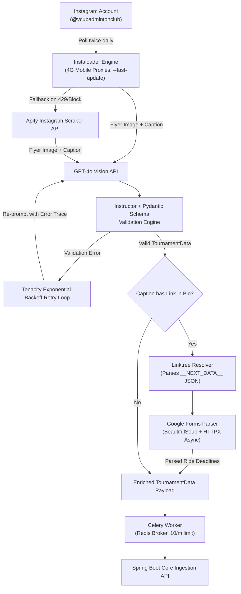

# Architecture Deep Dive: Multi-Hop Scraping & AI Vision Pipeline

## The Extraction Funnel

## Anti-Bot Mitigation Strategies
1. **Instaloader `--fast-update`**:
   Only processes posts published after the latest recorded timestamp, reducing the request footprint by > 90%.
2. **Mobile & Residential Proxy Pools**:
   Rotates IP addresses across residential carrier pools to prevent TLS connection fingerprinting and IP bans.
3. **HTTPX Connection Pooling & Semaphores**:
   Maintains a persistent connection pool (`max_keepalive_connections=40`) and limits concurrency with `asyncio.Semaphore` to avoid overwhelming upstream APIs.
4. **Celery Visibility Timeout Extension**:
   Extends Celery's Redis visibility timeout to `7200` seconds (2 hours) to prevent task duplication during prolonged multimodal LLM processing.

