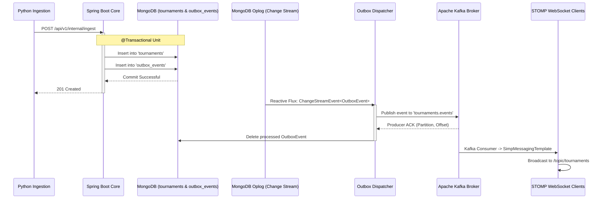

# Architecture Deep Dive: Transactional Outbox & Change Streams

## The Dual-Write Problem in Microservices
When an incoming tournament payload is validated, the system must perform two critical operations:
1. Persist the tournament record into the database for querying.
2. Publish an event to Apache Kafka so connected WebSocket clients can receive immediate notifications.

If executed sequentially:
- If the database write succeeds, but the Kafka publish fails (due to network partition or broker restart), the tournament is stored, but athletes **never receive an alert**.
- If Kafka is published first and the database write fails, athletes receive an alert for a tournament that **does not exist** in the database.

---

## The Solution: Transactional Outbox Pattern



### Key Implementation Details
1. **Atomic Multi-Document Transaction**:
   The Spring Boot application wraps both collection writes in a single `@Transactional` method:
   ```java
   @Transactional
   public Mono<Tournament> ingestTournament(Tournament tournament) {
       return tournamentRepository.save(tournament)
           .flatMap(saved -> outboxEventRepository.save(createOutboxEvent(saved))
           .thenReturn(saved));
   }
   ```

2. **MongoDB Change Streams**:
   Instead of inefficient database polling (`SELECT * FROM outbox WHERE processed = false`), the system subscribes reactively to the MongoDB Operation Log (oplog) using `ReactiveMongoTemplate`:
   ```java
   reactiveMongoTemplate.changeStream("outbox_events", options, OutboxEvent.class)
       .subscribe(this::handleEvent);
   ```

3. **Resume Tokens for Fault Tolerance**:
   MongoDB Change Streams supply an opaque **resume token** with every event. If the Spring Boot service crashes, it reconnects using the saved resume token and replays any missed oplog records in exact chronological order.

